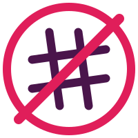
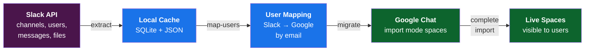

<p align="center">
  
</p>

<h1 align="center">noslacking</h1>

<p align="center"><strong>Migrate your Slack workspace to Google Chat — fully, faithfully, and for free.</strong></p>

---

[💡 Why?](#-why) · [✨ Features](#-features) · [📋 Prerequisites](#-prerequisites) · [📦 Installation](#-installation) · [🚀 Quick Start](#-quick-start) · [🛠 Commands](#-commands) · [⚙️ Configuration](#️-configuration) · [🔍 How It Works](#-how-it-works) · [📁 Data Directory](#-data-directory) · [👩‍💻 Development](#-development) · [📄 License](#-license)

---

No Slack export files needed. Reads directly from the Slack API, transforms messages/threads/files/reactions, and writes them into Google Chat using [import mode](https://developers.google.com/workspace/chat/import-data-overview) so that original timestamps and authors are preserved.

```
$ noslacking migrate

  Migrating 47 channels...
  ━━━━━━━━━━━━━━━━━━━━━━━━━━━━━━━━━━━━━━━━ 100% 47/47

       Migration Summary
  ┌────────────────────┬───────┐
  │ Metric             │ Count │
  ├────────────────────┼───────┤
  │ Channels Created   │    47 │
  │ Channels Completed │    47 │
  │ Messages Migrated  │ 84291 │
  │ Members Added      │   312 │
  │ Files Uploaded     │  1038 │
  └────────────────────┴───────┘
```

## 💡 Why?

At [Asaak](https://asaak.com), we were paying almost as much for Slack as for the rest of our productivity suite (Google Workspace). Slack is great and it feels great... but that made us stop and think; are the vibes worth it?

We already use Google Workspace, which has Chat... a product that didn't get much love in the past. But recently... Google added threaded messages and many other UX improvements and features to Chat. It signaled a real commitment to making Chat a first-class collaboration tool — so we decided to make the switch.

The problem: Slack makes it surprisingly hard to leave. Even on a paid plan with unlimited data retention, exporting your full history — including DMs and private channels — requires a Business+ or Enterprise tier, and even then it's a manual, clunky process. Slack's data export is designed to keep you locked in, not to help you move on. Just when we are trying to save on costs, we are asked to upgrade before we can see a majority of the "unlimited data" we have been paying for.

So we built `noslacking`: a free, open-source migration tool that:

- **Extracts everything automatically** using Slack's official API — no manual exports, no tier upgrades
- **Restores messages faithfully** in Google Chat — each message appears as the original author with its original timestamp, files, and reactions intact
- **Handles DMs and private groups** — the conversations Slack makes hardest to export are fully supported

We open-sourced it because no company should have to pay extra just to access their own data.

### noslacking vs. Slack Export

|  | Slack Export | noslacking |
|--|-------------|------------|
| Public channels | All plans | :white_check_mark: All plans |
| Private channels & DMs | Business+ / Enterprise only | :white_check_mark: Any plan |
| Original timestamps | Flat JSON files | :white_check_mark: Restored in Chat |
| Message authorship | Metadata only | :white_check_mark: Original sender |
| Files & reactions | Separate download | :white_check_mark: Automatic |
| Threads | Flattened | :white_check_mark: Preserved |
| Automation | Manual request + wait | :white_check_mark: One command |
| Cost | May require plan upgrade | :white_check_mark: Free & open source |

## ✨ Features

- **API-only** — reads directly from Slack's API, no export needed
- **DMs and group DMs** — migrates private conversations on any plan
- **Preserves history** — original timestamps and authors in Google Chat
- **Threads** — replies stay threaded
- **Files** — downloaded from Slack, uploaded to Google Drive or Chat
- **Reactions** — re-created per user where supported
- **User mapping** — matches Slack to Google Workspace users by email
- **Resumable** — SQLite state tracking; safe to interrupt and resume
- **Multi-process** — run parallel extractions/migrations for speed
- **Incremental sync** — sync new messages after initial migration
- **Dry-run mode** — preview without writing to Google Chat
- **Channel filtering** — migrate all channels or a subset

## 📋 Prerequisites

### Python

Python 3.12+ and [uv](https://docs.astral.sh/uv/) (recommended) or pip.

### Slack App

Create a Slack app at [api.slack.com/apps](https://api.slack.com/apps) with the following **bot token scopes**:

| Scope | Purpose |
|-------|---------|
| `channels:read` | List public channels |
| `channels:history` | Read public channel messages |
| `groups:read` | List private channels |
| `groups:history` | Read private channel messages |
| `users:read` | List users |
| `users:read.email` | Read user email addresses |
| `files:read` | Access file metadata and downloads |
| `reactions:read` | Read message reactions |

Install the app to your workspace and copy the **Bot User OAuth Token** (`xoxb-...`).

Optionally, generate a **User OAuth Token** (`xoxp-...`) for broader access to private channels and DMs.

### Google Cloud

1. Create a [GCP project](https://console.cloud.google.com/) (or use an existing one)
2. Enable the following APIs:
   - **Google Chat API**
   - **Admin SDK API**
   - **Google Drive API** (if uploading files to Drive)
3. Create a **service account** with a JSON key file
4. Enable **domain-wide delegation** on the service account
5. In the Google Workspace Admin Console, authorize the service account client ID with these scopes:
   - `https://www.googleapis.com/auth/chat.import`
   - `https://www.googleapis.com/auth/chat.spaces`
   - `https://www.googleapis.com/auth/chat.spaces.create`
   - `https://www.googleapis.com/auth/chat.memberships`
   - `https://www.googleapis.com/auth/chat.messages`
   - `https://www.googleapis.com/auth/chat.messages.create`
   - `https://www.googleapis.com/auth/admin.directory.user.readonly`
   - `https://www.googleapis.com/auth/drive.file` (if using Drive uploads)

## 📦 Installation

```bash
# Clone the repository
git clone https://github.com/YOUR_ORG/noslacking.git
cd noslacking

# Install with uv (recommended)
uv sync

# Or install with pip
pip install -e .
```

## 🚀 Quick Start

```bash
# 1. Interactive setup — walks you through Slack + Google configuration
uv run noslacking setup

# 2. Extract all Slack data into local cache
uv run noslacking extract

# 3. Map Slack users to Google Workspace users by email
uv run noslacking map-users

# 4. Validate credentials, data, and mappings
uv run noslacking validate

# 5. Execute the migration
uv run noslacking migrate

# 6. Check progress at any time
uv run noslacking status
```

## 🛠 Commands

### `setup`

Interactive wizard that collects Slack tokens, Google service account path, domain, and admin email. Validates credentials and writes `config.yaml` + `.env`.

```bash
uv run noslacking setup
uv run noslacking setup --reset          # Overwrite existing config
uv run noslacking setup --data-dir /opt/migration
```

### `extract`

Pulls all channels, users, messages, threads, and file metadata from Slack into a local SQLite database and JSON cache.

```bash
uv run noslacking extract
uv run noslacking extract --channels general,engineering
uv run noslacking extract --since 2024-01-01T00:00:00Z
uv run noslacking extract --skip-threads --skip-files
uv run noslacking extract --no-resume    # Re-extract everything

# Run multiple extractions in parallel (safe — each process works on different channels)
uv run noslacking extract --channels general,engineering,product &
uv run noslacking extract --channels support,sales,marketing &
wait
```

### `map-users`

Matches Slack users to Google Workspace users by email address. Supports manual overrides via config or CSV.

```bash
uv run noslacking map-users
uv run noslacking map-users --export mapping.csv    # Export for review
uv run noslacking map-users --import mapping.csv    # Import edited CSV
```

### `validate`

Pre-flight checks: verifies Slack and Google credentials, checks extracted data, and reports unmapped users.

```bash
uv run noslacking validate
uv run noslacking validate --strict      # Treat warnings as errors
```

### `migrate`

Creates Google Chat spaces in import mode, posts messages with original timestamps and authors, uploads files, adds reactions, then completes import to make spaces visible.

```bash
uv run noslacking migrate
uv run noslacking migrate --channels general,random
uv run noslacking migrate --dry-run      # Preview without writing
uv run noslacking migrate --skip-files
uv run noslacking migrate --skip-members
uv run noslacking migrate --max-channels 5
uv run noslacking migrate --complete     # Only complete stuck imports
```

### `status`

Shows overall migration progress and optionally a per-channel breakdown.

```bash
uv run noslacking status
uv run noslacking status --detail
uv run noslacking status --errors        # Show only failed channels
```

### `sync`

Incremental sync — fetches new messages posted since the last migration and posts them to the corresponding Google Chat spaces.

```bash
uv run noslacking sync
uv run noslacking sync --channels general
uv run noslacking sync --dry-run
```

## ⚙️ Configuration

The `setup` command generates a `config.yaml` file. You can also create one manually using [`config.example.yaml`](config.example.yaml) as a template.

Secrets (Slack tokens) are loaded from environment variables or a `.env` file — they are never written to the YAML config.

### Environment Variables

| Variable | Description |
|----------|-------------|
| `SLACK_BOT_TOKEN` | Slack bot token (`xoxb-...`) |
| `SLACK_USER_TOKEN` | Slack user token (`xoxp-...`, optional) |
| `GOOGLE_SERVICE_ACCOUNT_KEY` | Path to service account JSON (alternative to config) |
| `NOSLACKING_CONFIG` | Override config file path |
| `NOSLACKING_DATA_DIR` | Override data directory |

### Config Reference

See [`config.example.yaml`](config.example.yaml) for all options. Key settings:

| Section | Option | Default | Description |
|---------|--------|---------|-------------|
| `slack` | `channel_types` | `[public_channel, private_channel]` | Channel types to include |
| `slack` | `include_channels` | `[]` | Whitelist (empty = all) |
| `slack` | `exclude_channels` | `[]` | Blacklist |
| `slack` | `max_file_size_mb` | `100` | Skip files larger than this |
| `google` | `file_upload_method` | `google_drive` | `google_drive` or `chat_api` |
| `google` | `messages_per_second` | `8` | Rate limit for Chat API writes |
| `user_mapping` | `strategy` | `email` | How to match users (`email` or `manual`) |
| `user_mapping` | `unmapped_action` | `attribute` | `attribute` (post as admin with name) or `skip` |
| `migration` | `space_name_template` | `[Slack] {name}` | Google Chat space display name |
| `migration` | `dry_run` | `false` | Default dry-run setting |

## 🔍 How It Works

### Migration Flow



1. **Extract** — reads all channels, users, messages, threads, and file metadata from Slack via API and stores them in a local SQLite database
2. **Map users** — matches Slack users to Google Workspace accounts by email address
3. **Create spaces** — creates Google Chat spaces in [import mode](https://developers.google.com/workspace/chat/import-data-overview), which allows setting historical `createTime` on messages
4. **Post messages** — sends each message impersonating the original author (via domain-wide delegation), preserving timestamps and threading
5. **Upload files** — downloads attachments from Slack and uploads to Google Drive, linking them back in the message
6. **Add reactions** — re-creates emoji reactions per user
7. **Complete import** — calls `completeImport` to end import mode and make the space visible
8. **Add members** — adds channel members to the Google Chat space as active members

### Status Tracking

```
$ noslacking status --detail

       Migration Status
  ┌──────────────────┬───────┐
  │ Metric           │ Value │
  ├──────────────────┼───────┤
  │ Total Channels   │    47 │
  │   completed      │    44 │
  │   migrating      │     2 │
  │   pending        │     1 │
  │ Total Users      │    86 │
  │   Mapped         │    81 │
  │ Messages (done)  │ 79104 │
  │ Messages (pend)  │  5187 │
  └──────────────────┴───────┘

            Channel Details
  ┌──────────────┬─────────┬──────┬───────────┐
  │ Channel      │ Type    │ Msgs │ Status    │
  ├──────────────┼─────────┼──────┼───────────┤
  │ #general     │ public  │ 8291 │ completed │
  │ #engineering │ public  │ 4102 │ completed │
  │ #random      │ public  │ 3847 │ migrating │
  │ ...          │         │      │           │
  └──────────────┴─────────┴──────┴───────────┘
```

### Resumability

All state is tracked in `~/.noslacking/migration.db` (SQLite). If the process is interrupted, re-running the same command picks up where it left off. Each message, file, and membership has an individual migration status.

### User Impersonation

Messages are posted as the original author using Google Workspace domain-wide delegation. If a Slack user has no matching Google account, the message is posted by the admin account with an attribution line (e.g., `*John Doe:* original message`).

## 📁 Data Directory

By default, all data is stored in `~/.noslacking/`:

```
~/.noslacking/
  config.yaml          # Configuration (no secrets)
  .env                 # Slack tokens
  migration.db         # SQLite database (migration state)
  service-account.json # Google service account key
  cache/               # Raw JSON cache of Slack data
    users.json
    channels/<id>/messages.json
  cache/files/         # Downloaded Slack file attachments
  logs/                # Rotating log files
```

## 👩‍💻 Development

```bash
# Install with dev dependencies
uv sync --extra dev

# Run linter
uv run ruff check src/

# Run type checker
uv run mypy src/

# Run tests
uv run pytest
```

## 📄 License

[MIT](LICENSE)

---

